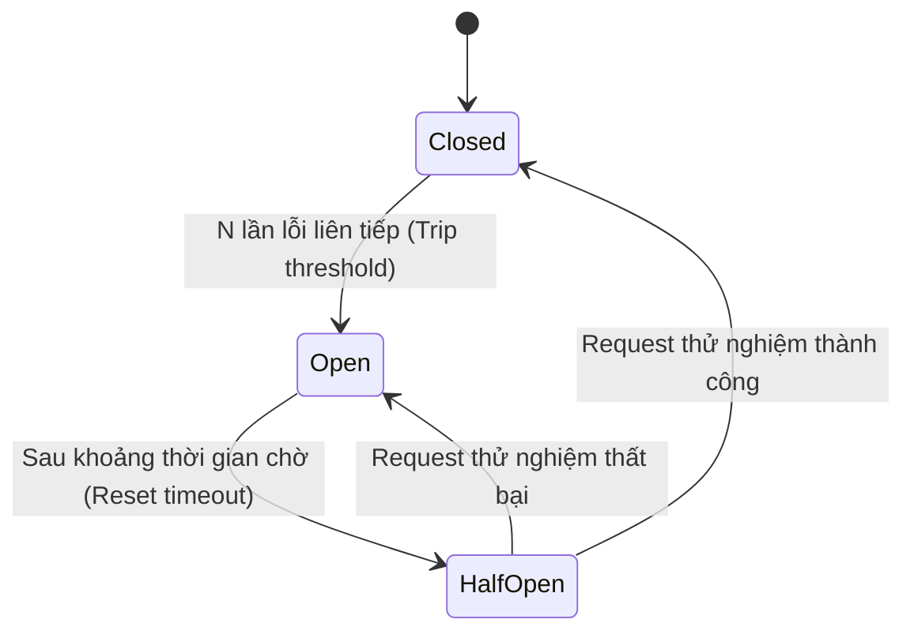

# CCAF Master Knowledge Reference (Claude Certified Architect Foundations)

Tài liệu này được trích xuất và hệ thống hóa từ toàn bộ 644 câu hỏi trắc nghiệm kiến trúc thực chiến (mock exam dataset). Mọi khái niệm, cơ chế kỹ thuật, cú pháp, anti-pattern và tiêu chí ra quyết định đều được trình bày chi tiết phục vụ cho việc ôn luyện và thi chứng chỉ CCAF.

---

# PHẦN 1: AGENT ARCHITECTURE & ORCHESTRATION

## 1.1 Vòng Lặp Agentic & Kiểm Soát Dừng (Agentic Loops & Termination Guardrails)

### Khái niệm: Stateless API Contract & Message Pair Validation
**Định nghĩa:** Claude Messages API là giao diện phi trạng thái (stateless). Mọi lượt gọi (turn) trong một agentic loop bắt buộc phải truyền lại toàn bộ lịch sử hội thoại dưới dạng các cặp tin nhắn hợp lệ.
**Cơ chế hoạt động:**
- Khi mô hình yêu cầu gọi công cụ (`stop_reason: "tool_use"`), tin nhắn của assistant chứa một hoặc nhiều khối `tool_use` (mỗi khối có `id`, `name`, `input`).
- Phía client thực thi tool và bắt buộc phải phản hồi bằng một tin nhắn `role: "user"` chứa đúng số lượng khối `tool_result` tương ứng với từng `tool_use_id`.
- Nếu thiếu bất kỳ `tool_result` nào hoặc sai lệch thứ tự/id, API sẽ trả về lỗi HTTP 400 Validation Error.
**Khi nào dùng:** Áp dụng trong mọi vòng lặp agent tương tác với tools.
**Khi nào KHÔNG dùng:** Không áp dụng khi gọi single-turn completion không sử dụng công cụ.
**Anti-patterns thường gặp trong đề thi:**
- *Anti-pattern 1:* Gửi tin nhắn `user` mới chỉ chứa câu hỏi tiếp theo mà bỏ qua việc gửi `tool_result` cho các `tool_use` trước đó.
- *Anti-pattern 2:* Chỉ gửi lại `tool_result` mới nhất mà cắt bỏ toàn bộ lịch sử hội thoại trước đó (làm mất context của vòng lặp).
**Phân biệt với các khái niệm tương tự:**
- `stop_reason: "tool_use"`: Mô hình tạm dừng để chờ kết quả từ client.
- `stop_reason: "end_turn"`: Mô hình đã hoàn thành nhiệm vụ và đưa ra câu trả lời cuối cùng.
- `stop_reason: "max_tokens"`: Mô hình bị cắt ngang do chạm giới hạn token xuất ra (cần tăng `max_tokens` hoặc prompt model chia nhỏ output).
**Ví dụ / Syntax cụ thể:**
```json
// Turn 1 Assistant Response:
{
  "role": "assistant",
  "content": [
    {"type": "text", "text": "Đang tra cứu cơ sở dữ liệu..."},
    {"type": "tool_use", "id": "toolu_01A", "name": "sql_query", "input": {"query": "SELECT * FROM users"}}
  ],
  "stop_reason": "tool_use"
}

// Turn 2 Client Request (bắt buộc role: user):
{
  "role": "user",
  "content": [
    {"type": "tool_result", "tool_use_id": "toolu_01A", "content": "[{\"id\": 1, \"name\": \"Alice\"}]"}
  ]
}
```

---

### Khái niệm: Termination Guardrails & Safety Caps
**Định nghĩa:** Cơ chế bảo vệ bắt buộc nhằm ngăn chặn agent rơi vào vòng lặp vô tận (infinite loop), cạn kiệt ngân sách hoặc bão hòa tài nguyên khi gặp lỗi lặp đi lặp lại.
**Cơ chế hoạt động:**
- Bộ điều khiển vòng lặp (orchestrator loop) duy trì một biến đếm `iteration_count`.
- Thiết lập một ngưỡng cứng (`max_iterations`, ví dụ: 10 - 25 turns) và/hoặc ngân sách token (`max_budget_tokens`).
- Khi chạm ngưỡng mà agent chưa trả về `stop_reason: "end_turn"`, vòng lặp bị ngắt cưỡng bức và kích hoạt luồng Escalation / Fallback.
**Khi nào dùng:** Mọi hệ thống autonomous agent chạy trên môi trường production.
**Khi nào KHÔNG dùng:** Không bao giờ được bỏ qua safety cap trong autonomous loops.
**Anti-patterns thường gặp trong đề thi:**
- Dựa vào việc mô hình "tự biết dừng" bằng prompt hướng dẫn ("Hãy dừng lại nếu không tìm thấy dữ liệu") thay vì cài đặt hard limit bằng mã code điều khiển.

---

## 1.2 Các Mô Hình Điều Phối (Orchestration Patterns)

### Khái niệm: Routing Pattern (Phân Tuyến Phân Loại)
**Định nghĩa:** Sử dụng một mô hình nhanh, chi phí thấp (như Claude 3.5 Haiku) để phân loại ý định (intent) của người dùng trước khi chuyển tiếp sang agent hoặc luồng xử lý chuyên biệt.
**Cơ chế hoạt động:** Phân tích đầu vào -> Phân loại vào 1 trong N danh mục (Category/Intent) -> Gọi Agent/Prompt chuyên biệt xử lý danh mục đó.
**Khi nào dùng:** Hệ thống đa chức năng (customer support, multi-intent bots) có khối lượng yêu cầu lớn và độ phức tạp phân hóa mạnh.
**Khi nào KHÔNG dùng:** Khi tác vụ yêu cầu thực thi nhiều bước phối hợp phức tạp qua lại (cần Orchestrator-Workers thay vì Router).
**Phân biệt:**
- Router: Chỉ phân nhánh 1 lần ở đầu luồng (1-to-1 routing).
- Orchestrator-Workers: Chia nhỏ 1 tác vụ phức tạp thành nhiều tác vụ con chạy song song hoặc tuần tự.

---

### Khái niệm: Orchestrator-Workers Pattern
**Định nghĩa:** Một mô hình trung tâm (Orchestrator/Coordinator) chịu trách nhiệm phân tích bài toán, chia nhỏ thành các nhiệm vụ độc lập và điều phối các worker chuyên biệt thực thi.
**Cơ chế hoạt động:**
1. Coordinator nhận yêu cầu lớn, phân rã thành các subtasks.
2. Coordinator kích hoạt các worker (hoặc subagent) chạy độc lập (thường song song qua nhiều tool calls trong cùng 1 turn).
3. Coordinator tổng hợp các kết quả trả về từ workers để đưa ra output cuối cùng.
**Khi nào dùng:** Tác vụ tổng hợp dữ liệu từ nhiều nguồn độc lập, phân tích đa chiều (ví dụ: phân tích tài chính + phân tích tin tức đồng thời).
**Khi nào KHÔNG dùng:** Các tác vụ tuần tự nghiêm ngặt trong đó output của bước A bắt buộc là input của bước B (nên dùng Sequential Prompt Chaining).

---

### Khái niệm: Evaluator-Optimizer (Generator-Critic Loop)
**Định nghĩa:** Vòng lặp tối ưu chất lượng gồm 2 vai trò: một agent tạo nội dung (Generator/Worker) và một agent đánh giá độc lập (Evaluator/Critic) chấm điểm dựa trên tiêu chí nghiêm ngặt.
**Cơ chế hoạt động:**
1. Generator tạo bản thảo ban đầu.
2. Evaluator đối chiếu bản thảo với bộ rubric/quy chuẩn.
3. Nếu đạt -> Trả về kết quả; Nếu không đạt -> Trả về phản hồi chi tiết (specific feedback) để Generator viết lại.
**Khi nào dùng:** Dịch thuật chuyên sâu, sinh mã nguồn tuân thủ coding convention, viết tài liệu pháp lý đòi hỏi độ chính xác cao.
**Anti-patterns:** Để chính agent tạo nội dung tự đánh giá lại tác phẩm của mình trong cùng 1 prompt mà không có tiêu chí khách quan độc lập.

---

## 1.3 Quản Lý Ngữ Cảnh Subagent & Phân Rã Tác Vụ (Subagents & Task Decomposition)

### Khái niệm: Isolated Subagent Context (Ngữ Cảnh Cô Lập Của Subagent)
**Định nghĩa:** Mỗi subagent khi được khởi tạo phải có một context window hoàn toàn riêng biệt, không kế thừa toàn bộ lịch sử hội thoại cồng kềnh của coordinator.
**Cơ chế hoạt động:**
- Coordinator gọi subagent thông qua một custom tool (ví dụ: `Task` tool hoặc `InvokeSubagent`).
- Tham số truyền vào chỉ gồm: Mô tả nhiệm vụ cụ thể (`task_description`) và dữ liệu đầu vào tối thiểu cần thiết.
- Subagent thực thi vòng lặp riêng của nó và chỉ trả về bản tóm tắt kết quả (synthesized summary) cho Coordinator.
**Khi nào dùng:** Các tác vụ phức tạp, điều tra nhiều file/service để tránh token explosion (bùng nổ token) và context contamination.
**Anti-patterns:** Truyền toàn bộ 100k tokens lịch sử trò chuyện của root agent vào từng subagent con.

---

### Khái niệm: Attention Dilution & Multi-Pass Architecture
**Định nghĩa:** Hiện tượng mô hình giảm sút khả năng chú ý và độ chính xác khi phải xử lý quá nhiều đối tượng/files trong một lần quét (single context pass).
**Cơ chế hoạt động:**
- *Vấn đề:* Quét 20 microservices cùng lúc sẽ dẫn đến việc các service đầu được phân tích kỹ, các service cuối bị bỏ sót hoặc nhận định thiếu nhất quán (inconsistent findings).
- *Giải pháp (Multi-pass Architecture):*
  - **Pass 1 (Local Analysis Pass):** Mỗi service/file được phân tích độc lập trong một subagent/pass riêng biệt với full attention.
  - **Pass 2 (Cross-service Integration Pass):** Một pass riêng biệt tổng hợp tất cả kết quả local để chuẩn hóa và đối chiếu các pattern chéo.
**Khi nào dùng:** Security audit hàng loạt repos, rà soát hợp đồng pháp lý số lượng lớn.
**Anti-patterns:** Nâng cấp lên context window lớn hơn và hy vọng model sẽ tự chú ý đều 100% (Context window lớn không giải quyết được Attention Dilution).

---

## 1.4 Agent SDK Hooks: PreToolUse vs PostToolUse

### Khái niệm: Agent SDK Lifecycle Hooks
**Định nghĩa:** Các hàm đánh chặn (interceptors) được đăng ký trong Agent SDK để can thiệp vào trước hoặc sau khi tool được thực thi thực tế.
**So sánh chi tiết:**

| Tiêu chí | `PreToolUse` Hook | `PostToolUse` Hook |
| :--- | :--- | :--- |
| **Thời điểm chạy** | Ngay sau khi LLM emit `tool_use`, TRƯỚC KHI tool code thực thi. | Ngay sau khi tool code chạy xong, TRƯỚC KHI kết quả gửi về cho LLM. |
| **Mục đích chính** | - Kiểm tra quyền hạn (Access Control / RBAC)<br>- Xác thực & chặn các lệnh nguy hiểm (rm -rf, DROP TABLE)<br>- Sửa đổi/chuẩn hóa tham số đầu vào (Parameter sanitization) | - Lọc bỏ dữ liệu nhạy cảm / PII (Data Masking)<br>- Cắt tỉa kết quả quá dài (Context Trimming)<br>- Chuyển đổi mã lỗi hệ thống thành Structured Error. |
| **Khả năng can thiệp** | Có thể hủy bỏ (Abort) lệnh gọi tool hoặc sửa đổi input params. | Có thể sửa đổi nội dung `tool_result` hoặc gán cờ lỗi `is_error: true`. |

**Ví dụ về PreToolUse Hook (Bảo vệ cơ sở dữ liệu):**
```python
def pre_tool_hook(tool_name, tool_input, context):
    if tool_name == "bash" and "rm -rf" in tool_input.get("command", ""):
        raise PermissionError("Lệnh nguy hiểm bị chặn bởi chính sách an toàn.")
    return tool_input
```

---

# PHẦN 2: TOOL DESIGN & MODEL CONTEXT PROTOCOL (MCP)

## 2.1 Thiết Kế Tool Schema Chuẩn Mực

### Khái niệm: Granular Tools vs Monolithic Tools
**Định nghĩa:** Nguyên tắc chia nhỏ công cụ thành các hàm đơn nhiệm rõ ràng thay vì tạo một công cụ khổng lồ đa năng.
**Tiêu chí thiết kế:**
- Cung cấp mô tả (`description`) chi tiết, giải thích rõ tool làm gì và khi nào nên dùng.
- Sử dụng kiểu dữ liệu nghiêm ngặt: `enum` cho các giá trị cố định, quy định rõ ràng các trường `required`.
- **Idempotency:** Các tool thực hiện hành động ghi (write/update) cần hỗ trợ `idempotency_key` để khi agent retry do timeout sẽ không gây trùng lặp dữ liệu (ví dụ: trừ tiền 2 lần).

---

### Khái niệm: Structured Error Responses & Actionable Feedback
**Định nghĩa:** Chuẩn định dạng phản hồi lỗi từ công cụ giúp LLM hiểu được nguyên nhân thất bại và tự động sửa sai (self-correct).
**Quy tắc phân loại lỗi:**
1. **Phân biệt rạch ròi:**
   - `is_error: true`: Dùng khi xảy ra lỗi hệ thống, sai quyền, crash, API downstream chết.
   - `is_error: false` (Kết quả rỗng `[]`): Dùng khi truy vấn thành công nhưng không tìm thấy dữ liệu (ví dụ: tìm kiếm user không tồn tại). Trả về lỗi khi kết quả rỗng sẽ khiến agent tưởng hệ thống hỏng và retry vô ích.
2. **Cờ `retryable`:** Chỉ rõ cho agent biết lỗi này có thể thử lại được không (ví dụ: Rate limit -> `retryable: true`; Sai cú pháp SQL -> `retryable: false`, cần viết lại query).
3. **Actionable Feedback:** Thông báo lỗi phải chỉ ra cách sửa cụ thể (ví dụ: `"Cột 'user_name' không tồn tại trong bảng 'users'. Các cột hợp lệ gồm: [id, username, email]"`).

---

## 2.2 Model Context Protocol (MCP)

### Khái niệm: 3 Primitives cốt lõi của MCP

| Primitive | Quyền kiểm soát | Định nghĩa & Mục đích |
| :--- | :--- | :--- |
| **Tools** | **Model-controlled** | Các hàm/hành động mà mô hình chủ động quyết định gọi (có side effects hoặc truy vấn động). |
| **Resources** | **Application-controlled** | Dữ liệu thụ động dạng file/URI/logs mà ứng dụng hoặc user gắn vào ngữ cảnh để mô hình đọc. |
| **Prompts** | **User-controlled** | Các mẫu prompt hoặc workflow được cấu hình sẵn trên server để người dùng kích hoạt nhanh. |

---

### Khái niệm: MCP Transports (`stdio` vs `SSE / HTTP`)

| Tiêu chí | `stdio` Transport | `SSE / Streamable HTTP` Transport |
| :--- | :--- | :--- |
| **Môi trường chạy** | Local trên cùng một máy với client. | Remote qua mạng internet / intranet. |
| **Giao tiếp qua** | Standard Input / Standard Output của tiến trình con (subprocess). | Giao thức Server-Sent Events (SSE) và HTTP POST. |
| **Bảo mật & Quản lý** | Khởi chạy cục bộ, kế thừa quyền của tiến trình cha. | Cần cơ chế xác thực mạng (OAuth, API Tokens, mTLS). |
| **Use case điển hình** | Claude Desktop kết nối với local SQLite, Git repo, filesystem. | Kết nối enterprise tools phân tán, Jira server, cloud database. |

---

## 2.3 Công Cụ Tích Hợp Sẵn: Glob vs Grep
- **Glob Tool:** Tìm kiếm đường dẫn file/thư mục dựa trên mẫu tên file (ví dụ: `**/*.test.ts`). Cực nhanh vì chỉ quét metadata cây thư mục, không đọc nội dung file.
- **Grep Tool:** Tìm kiếm chuỗi văn bản hoặc biểu thức chính quy (Regex) bên trong nội dung các file (ví dụ: tìm nơi khai báo `class OrderService`). Tốn I/O hơn Glob.

---

# PHẦN 3: CLAUDE CODE CONFIGURATION & WORKFLOWS

## 3.1 Hệ Thống Phân Cấp Cấu Hình CLAUDE.md

### Khái niệm: Three-Tier CLAUDE.md Hierarchy
**Cấu trúc 3 cấp độ kế thừa:**
1. **Global User Rules (`~/.claude/CLAUDE.md`):** Áp dụng cho mọi dự án của người dùng trên máy (ví dụ: sở thích ngôn ngữ, phong cách code cá nhân).
2. **Project Root Rules (`./CLAUDE.md`):** Áp dụng cho toàn bộ repository dự án (quy định lệnh build, test, coding conventions chung).
3. **Subdirectory Path Rules (`./src/backend/CLAUDE.md`):** Áp dụng chuyên biệt cho thư mục con. Quy tắc ở cấp con ghi đè hoặc mở rộng quy tắc ở cấp cha.

**Nguyên tắc vàng:**
- File `CLAUDE.md` phải súc tích, ngắn gọn (< 200 dòng). Tránh nhồi nhét tài liệu dài khiến mô hình bị quá tải chỉ dẫn (rule fatigue).
- Dùng **Glob Scoping** (Path-specific rules) để chỉ áp dụng luật cho các file tương ứng:
```markdown
# Path-specific rules
[src/api/**/*.ts]
- Luôn sử dụng Zod để validate input DTO.
- Mọi controller phải có unit test tương ứng trong tests/api.
```

---

## 3.2 Plan Mode & Headless Automation

### Khái niệm: Plan Mode Workflow
**Định nghĩa:** Chế độ vận hành phi phá hủy (Read-only / Exploration) của Claude Code.
**Cơ chế hoạt động:**
- Claude Code chỉ được phép sử dụng các công cụ đọc (`view_file`, `grep_search`, `list_dir`) để khảo sát kiến trúc mã nguồn.
- Mô hình lập ra kế hoạch chi tiết (`implementation_plan.md`) và tạm dừng để chờ người dùng phê duyệt trước khi thực hiện bất kỳ lệnh sửa đổi file nào.

---

### Khái niệm: CI/CD & Headless Automation Flags
**Định nghĩa:** Chạy Claude Code trong môi trường tự động hóa không tương tác (GitHub Actions, GitLab CI, Docker runners).
**Các cờ (Flags) bắt buộc:**
- `-p` hoặc `--print`: Chạy ở chế độ non-interactive (in kết quả ra stdout và kết thúc tiến trình).
- `--dangerously-skip-permissions`: Bỏ qua các hộp thoại hỏi quyền tương tác của người dùng khi chạy bash command hoặc sửa file.
- **Quy tắc an toàn tối cao:** Cờ `--dangerously-skip-permissions` **CHỈ ĐƯỢC PHÉP DÙNG** trong môi trường container sandbox bị cô lập mạng hoặc môi trường CI tạm thời. Tuyệt đối không khuyến nghị dùng trên máy trạm cá nhân chưa cô lập.

---

# PHẦN 4: PROMPT ENGINEERING & STRUCTURED OUTPUT

## 4.1 Phân Định Ranh Giới Bằng XML Tags

### Khái niệm: XML Semantic Boundaries
**Định nghĩa:** Sử dụng các cặp thẻ XML tường minh để phân tách cấu trúc prompt, giúp mô hình phân biệt rõ ràng giữa chỉ dẫn của hệ thống, ngữ cảnh dữ liệu và dữ liệu do người dùng cung cấp.
**Các thẻ chuẩn Anthropic:**
- `<instructions>`: Nhiệm vụ cốt lõi và các ràng buộc logic.
- `<context>`: Tài liệu tham khảo, dữ liệu nền tảng.
- `<user_query>`: Đầu vào từ người dùng (chống Prompt Injection).
- `<thinking>`: Không gian suy luận từng bước (Chain-of-Thought).
- `<output>`: Định dạng kết quả đầu ra cuối cùng.

---

## 4.2 Xử Lý Trường Nullable Trong JSON Schema (Quy Tắc Vàng)

### Khái niệm: Explicit Nullable Fields & Required List
**Vấn đề:** Khi trích xuất dữ liệu có cấu trúc, nếu một thông tin vắng mặt trong tài liệu nguồn, LLM thường có xu hướng:
1. Tự bịa (hallucinate) ra một giá trị giả để thỏa mãn schema.
2. Hoặc bỏ qua hoàn toàn key đó trong JSON output.

**Giải pháp chuẩn kiến trúc:**
- Bắt buộc khai báo kiểu dữ liệu cho phép `null`: `type: ["string", "null"]` (hoặc `oneOf: [{"type": "string"}, {"type": "null"}]`).
- **ĐỒNG THỜI** phải đưa tên trường đó vào mảng `"required"`.
- **Kết quả:** Mô hình bị ép buộc phải xuất ra `"field_name": null` khi không tìm thấy dữ liệu, loại bỏ hoàn toàn hiện tượng ảo giác.

**Ví dụ JSON Schema chuẩn:**
```json
{
  "type": "object",
  "properties": {
    "claim_id": {"type": "string"},
    "driver_license_number": {
      "type": ["string", "null"],
      "description": "Số bằng lái xe của tài xế. Trả về null nếu tài liệu không đề cập."
    }
  },
  "required": ["claim_id", "driver_license_number"],
  "additionalProperties": false
}
```

---

## 4.3 Validation & Retry Logic

### Khái niệm: Feedback Injection Pattern
**Quy trình 4 bước chuẩn:**
1. **Trích xuất (Extract):** Mô hình sinh JSON theo schema qua `tool_use`.
2. **Kiểm thực (Validate):** Hệ thống phía client validate output bằng parser nghiêm ngặt (như Zod/Pydantic).
3. **Tiêm phản hồi lỗi (Feedback Injection):** Nếu validate thất bại, gửi lại tin nhắn cho mô hình kèm theo thông báo lỗi cụ thể (ví dụ: `"Trường 'age' phải là số nguyên dương >= 18, nhận được: -5"`).
4. **Giới hạn cứng (Hard Limit):** Đặt ngưỡng tối đa 3 lần retry. Nếu vẫn lỗi -> Escalate cho con người xử lý.

---

# PHẦN 5: CONTEXT MANAGEMENT & RELIABILITY

## 5.1 Hiện Tượng Lost-in-the-Middle & State Store Bất Biến

### Khái niệm: Strategic Placement & Immutable State Store
**Định nghĩa:** Hiện tượng mô hình Transformer có sự chú ý (attention) mạnh nhất ở phần đầu (System Prompt) và phần cuối (Recent Turns) của context window, và giảm sút ở khoảng giữa.
**Giải pháp kiến trúc:**
- **Không dùng Progressive Summarization đơn thuần:** Việc tóm tắt liên tục qua từng turn sẽ làm suy giảm dần các sự kiện cốt lõi ở giữa hội thoại.
- **Duy trì Immutable Facts State Store:** Lưu trữ các biến trạng thái, quyết định quan trọng của người dùng vào một cấu trúc dữ liệu ngoài, và luôn inject cấu trúc này vào đầu hoặc cuối context của mỗi turn.

---

## 5.2 Context Pruning & Dynamic Tool Allocation

### Khái niệm: Tool Result Pruning
**Định nghĩa:** Kỹ thuật xóa bớt hoặc cắt tỉa (prune) phần nội dung thô khổng lồ của các `tool_result` ở các turn cũ đã hoàn thành.
**Cơ chế hoạt động:**
- Ở turn 2, agent đọc một file log 50KB.
- Ở turn 3, agent đã rút ra kết luận: "Lỗi do NullPointerException ở dòng 42".
- Ở turn 4 trở đi, orchestrator thay thế toàn bộ 50KB raw log ở turn 2 bằng chuỗi ngắn gọn `"[Log data pruned - root cause identified as NPE at line 42]"` để tiết kiệm token budget.

---

## 5.3 Error Propagation & Circuit Breaker Pattern

### Khái niệm: Circuit Breaker trong Hệ Thống Multi-Agent
**Định nghĩa:** Cơ chế ngắt mạch nhằm ngăn chặn hiện tượng bão retry (retry storm) làm sập hoàn toàn các dịch vụ phụ thuộc khi chúng đang bị suy thoái hoặc quá tải.
**3 trạng thái hoạt động:**



1. **Closed (Bình thường):** Mọi request được chuyển tiếp đến service.
2. **Open (Ngắt mạch):** Khi tỷ lệ lỗi vượt ngưỡng $N$, Circuit Breaker ngắt mạch ngay lập tức. Mọi request tiếp theo bị từ chối ngay mà không gửi đến service phụ thuộc, trả về fallback response.
3. **Half-Open (Thử nghiệm):** Sau một khoảng thời gian chờ, cho phép một lượng nhỏ request đi qua để thăm dò. Nếu thành công -> chuyển về Closed; Nếu tiếp tục lỗi -> quay lại Open.

---

## 5.4 Message Batches API

### Khái niệm: Async Bulk Processing
**Định nghĩa:** API chính thức của Anthropic dành cho các tác vụ xử lý hàng loạt bất đồng bộ không yêu cầu thời gian thực.
**Đặc tính kỹ thuật:**
- **Giảm 50% chi phí** (50% cost discount) so với API Messages thông thường.
- Xử lý tối đa **10,000 requests** hoặc **32MB** trong một batch duy nhất.
- Thời gian trả kết quả (SLA) trong vòng **24 giờ** (thường hoàn thành trong vài phút đến vài giờ).
- Hỗ trợ đầy đủ `custom_id` cho từng request để dễ dàng map kết quả trả về.

---

## 5.5 Long-Form Synthesis & Chống Ảo Giác Nguồn (Claim-to-Source Attribution)

### Khái niệm: Intermediate Verbatim Tuple Schema
**Định nghĩa:** Kiến trúc chống ảo giác khi tổng hợp các bài báo cáo, phân tích dài từ hàng chục tài liệu nguồn.
**Cơ chế hoạt động:**
- Không cho phép mô hình viết thẳng báo cáo hoàn chỉnh từ 40 tài liệu.
- Bắt buộc chia làm 2 giai đoạn:
  - **Giai đoạn 1 (Trích xuất bằng chứng):** Trích xuất danh sách các nhận định dưới dạng Tuple có cấu trúc: `{claim_text, source_document_id, verbatim_quote}` (bắt buộc trích dẫn nguyên văn câu gốc từ tài liệu).
  - **Giai đoạn 2 (Tổng hợp):** Agent viết báo cáo chỉ được phép sử dụng các claim đã được xác thực nguyên văn ở giai đoạn 1.

---

# ═══════════════════════════════════════════════
# PHẦN BỔ SUNG: CÁC KIẾN THỨC CÒN THIẾU (GAP FILL)
# ═══════════════════════════════════════════════

---

# PHẦN 1 (BỔ SUNG): AGENTIC LOOPS – CÁC ANGLE CỤ THỂ

## 1.1 (Bổ Sung) Xử Lý Song Song Tool Calls (Parallel Tool Execution)

### Khái niệm: Parallel Tool Result Matching
**Định nghĩa:** Khi LLM emit nhiều khối `tool_use` trong cùng một lượt phản hồi (một `stop_reason: "tool_use"` nhưng `content` chứa 2–N khối `tool_use`), phía client phải thực thi tất cả song song và trả về tất cả `tool_result` trong cùng 1 tin nhắn `user`.
**Cơ chế hoạt động:**
- LLM emit: `content: [tool_use(id="A", ...), tool_use(id="B", ...)]`
- Client chạy tool A và tool B **song song** (concurrent execution).
- Client phản hồi bằng 1 tin nhắn `user` chứa: `[tool_result(id="A"), tool_result(id="B")]`
- **Bắt buộc:** Không được gửi từng `tool_result` trong 2 tin nhắn riêng biệt. Tất cả `tool_result` cho các `tool_use` trong cùng 1 turn phải được gói trong 1 tin nhắn `user` duy nhất.
**Anti-patterns thường gặp trong đề thi:**
- Gửi `tool_result` A trước, chờ phản hồi, rồi mới gửi `tool_result` B – sai hoàn toàn.
- Chỉ gửi `tool_result` cho tool có kết quả nhanh nhất và bỏ qua tool kia.

---

### Khái niệm: Text Preamble + Tool Use trong Cùng 1 Turn
**Định nghĩa:** LLM có thể emit một block `text` (preamble/suy luận) TRƯỚC các block `tool_use` trong cùng một lượt phản hồi.
**Cơ chế hoạt động:**
```json
{
  "role": "assistant",
  "content": [
    {"type": "text", "text": "Tôi sẽ tra cứu dữ liệu người dùng..."},
    {"type": "tool_use", "id": "toolu_01", "name": "get_user", "input": {"id": 42}}
  ],
  "stop_reason": "tool_use"
}
```
- `stop_reason` vẫn là `"tool_use"` → client phải gửi `tool_result`.
- Không được nhầm lẫn rằng vì có text block thì agent đã `"end_turn"`.

---

### Khái niệm: Xử Lý stop_reason: "max_tokens"
**Định nghĩa:** Xảy ra khi output của model bị cắt ngang do chạm `max_tokens` giới hạn.
**Cơ chế xử lý đúng:**
- Kiểm tra `stop_reason == "max_tokens"` trong response.
- **Không được** tiếp tục loop như thể agent đã hoàn thành.
- Chiến lược 1: Tăng `max_tokens` trong lần gọi tiếp theo.
- Chiến lược 2: Prompt model chia nhỏ output (ví dụ: "Tiếp tục từ chỗ bạn dừng lại").
- Chiến lược 3: Kích hoạt Escalation nếu vượt quá ngưỡng retry.
**Anti-patterns:** Gọi lại API y hệt mà không thay đổi gì → lặp vô tận với `max_tokens`.

---

### Khái niệm: Tool Exception Delivery via is_error
**Định nghĩa:** Khi tool code phía client ném exception (crash, timeout, permission denied), kết quả phải được deliver về cho LLM thông qua `tool_result` với cờ `is_error: true` – KHÔNG được để exception lan ra ngoài orchestration loop.
**Ví dụ / Syntax cụ thể:**
```json
{
  "type": "tool_result",
  "tool_use_id": "toolu_01A",
  "content": "DatabaseConnectionError: Cannot connect to host db.prod after 3 retries. Retryable: true.",
  "is_error": true
}
```
**Tại sao:** LLM cần biết tool thất bại để có thể tự điều chỉnh chiến lược (thử tool khác, escalate, hoặc dừng lại).

---

## 1.4 Workflow Enforcement & Handoff (Thực Thi Luồng Nghiệp Vụ)

### Khái niệm: Deterministic State Machine cho Agentic Workflows
**Định nghĩa:** Thay vì để LLM tự do quyết định thứ tự các bước trong quy trình nghiệp vụ phức tạp, sử dụng một State Machine xác định (Deterministic State Machine) ở tầng orchestration để kiểm soát chặt chẽ các trạng thái và các chuyển tiếp hợp lệ.
**Cơ chế hoạt động:**
- Mỗi giai đoạn quy trình là một trạng thái (State): `DRAFT` → `REVIEW` → `APPROVED` → `EXECUTED`.
- Orchestrator chỉ cho phép LLM gọi các tools tương ứng với trạng thái hiện tại.
- Khi agent cố gắng nhảy bước (ví dụ: gọi `execute_order` khi chưa qua `APPROVED`), orchestrator từ chối và trả về lỗi.
**Khi nào dùng:** Quy trình tài chính, phê duyệt hợp đồng, CI/CD pipeline, bất kỳ workflow nào có thứ tự bước nghiêm ngặt và không thể đảo ngược.
**Khi nào KHÔNG dùng:** Tác vụ sáng tạo, nghiên cứu tự do không có thứ tự bước cứng.
**Anti-patterns thường gặp trong đề thi:**
- Chỉ dặn LLM trong System Prompt "Luôn thực hiện theo thứ tự A → B → C" mà không có cơ chế enforcement ở code → LLM vẫn có thể bỏ bước.

---

### Khái niệm: ApprovalService & Human-Gated Handoff
**Định nghĩa:** Điểm chờ tường minh trong workflow, buộc agent phải tạm dừng và yêu cầu phê duyệt từ con người (hoặc một service tự động) trước khi thực thi hành động có rủi ro cao (irreversible action).
**Cơ chế hoạt động:**
1. Agent hoàn thành giai đoạn phân tích/chuẩn bị.
2. Agent gọi `request_approval(action_description, risk_level, payload)`.
3. `ApprovalService` lưu request vào queue và trả về `status: "PENDING"`.
4. Agent **dừng hoàn toàn** (không tiếp tục loop).
5. Sau khi con người phê duyệt/từ chối, event được gửi lại cho agent để tiếp tục.
**Khi nào dùng:** Xóa dữ liệu hàng loạt, deploy lên production, gửi email marketing, chuyển khoản trên ngưỡng nhất định.

---

## 1.7 Session State & Resumption (Quản Lý Trạng Thái Phiên)

### Khái niệm: External State Store & Session Resumption
**Định nghĩa:** Cơ chế lưu trữ toàn bộ trạng thái của một agentic session ra bên ngoài (database, Redis, file) để có thể tiếp tục (resume) sau khi bị ngắt quãng do lỗi mạng, restart process, hoặc timeout.
**Cơ chế hoạt động:**
- Sau mỗi turn quan trọng, orchestrator serialize và lưu vào External State Store:
  - `session_id`: ID định danh phiên
  - `message_history`: Toàn bộ lịch sử hội thoại đã xảy ra
  - `current_step`: Bước hiện tại trong workflow
  - `tool_results_cache`: Kết quả tool đã hoàn thành (tránh gọi lại)
  - `user_decisions`: Các quyết định người dùng đã xác nhận
- Khi resume: Load state từ store → inject vào context → tiếp tục từ bước chưa hoàn thành.
**Khi nào dùng:** Long-running tasks (> 5 phút), tác vụ có nhiều bước không thể chạy lại từ đầu (data processing pipeline, multi-step negotiation).
**Anti-patterns thường gặp trong đề thi:**
- Lưu state trong memory của process → mất toàn bộ khi process crash.
- Chỉ lưu conversation history mà không lưu `current_step` → phải replay lại toàn bộ để xác định đang ở đâu.

---

# PHẦN 2 (BỔ SUNG): TOOL DESIGN – CÁC GAP

## 2.3 Tool Distribution & Least-Privilege Scoping

### Khái niệm: Least-Privilege Tool Allocation
**Định nghĩa:** Nguyên tắc mỗi agent/subagent chỉ được cấp đúng bộ công cụ tối thiểu cần thiết để hoàn thành nhiệm vụ của nó – không hơn.
**Cơ chế hoạt động:**
- **Sai:** Cấp toàn bộ 50 tools cho 1 coordinator agent xử lý mọi tác vụ.
  - Hậu quả: Token overhead khổng lồ (định nghĩa schema của 50 tools chiếm 10,000–20,000 tokens trong mỗi request), nguy cơ agent chọn nhầm tool.
- **Đúng:** Phân chia toolset chuyên biệt:
  - `DatabaseAgent` → chỉ có `[sql_query, sql_write, get_schema]`
  - `FileAgent` → chỉ có `[read_file, write_file, list_dir]`
  - `SearchAgent` → chỉ có `[web_search, semantic_search]`
**Khi nào dùng:** Mọi hệ thống multi-agent production.
**Lợi ích kép:**
1. **Bảo mật:** Giảm blast radius nếu một agent bị compromise.
2. **Hiệu suất:** Giảm token overhead, tăng tốc độ, giảm chi phí mỗi request.
**Anti-patterns thường gặp trong đề thi:**
- Giải pháp "Gộp tất cả tools vào 1 agent để đơn giản hóa kiến trúc" → đây là anti-pattern về cả bảo mật lẫn hiệu suất.

---

## 2.4 MCP – Các Primitive Chi Tiết (Bổ Sung)

### Khái niệm: MCP Resources vs Tools – Khi Nào Dùng Cái Nào
**Định nghĩa chi tiết:**
- **Tool:** Thực thi một hành động với side effects hoặc truy vấn động (kết quả thay đổi theo thời gian). Ví dụ: `run_query(sql)`, `send_email(to, body)`, `get_current_price(ticker)`.
- **Resource:** Dữ liệu tĩnh/bán tĩnh mà ứng dụng muốn tiết lộ cho model đọc. Ví dụ: `file://README.md`, `db://schema/users`, `log://app.log`. Model không "gọi" resource, application/user inject resource vào context.

**Tiêu chí ra quyết định:**

| Câu hỏi | Dùng Tool | Dùng Resource |
| :--- | :---: | :---: |
| Có side effects không? | ✅ | ❌ |
| Kết quả thay đổi theo thời gian? | ✅ | ❌ |
| Model chủ động quyết định khi nào truy cập? | ✅ | ❌ |
| Dữ liệu cố định, ứng dụng chủ động inject? | ❌ | ✅ |

---

### Khái niệm: MCP Prompts Primitive
**Định nghĩa:** MCP Prompts là các template workflow được cấu hình sẵn trên MCP Server, người dùng hoặc application có thể kích hoạt để khởi động một tác vụ với các tham số được điền sẵn.
**Phân biệt với Tool:**
- Tool: model gọi động theo ngữ cảnh.
- Prompt: người dùng/operator kích hoạt một workflow cụ thể có cấu trúc sẵn.
**Ví dụ thực tế:** MCP Server cho GitHub có thể expose một Prompt `"Create PR from branch"` → khi user kích hoạt, prompt template tự động điền `branch_name`, `target_branch`, `description` và khởi động workflow tạo PR.

---

## 2.6 Tool Chaining & Data Minimization

### Khái niệm: Output Projection trong Tool Chains
**Định nghĩa:** Kỹ thuật lọc và chiếu (project) chỉ những trường dữ liệu thực sự cần thiết từ output của tool trước khi truyền sang tool tiếp theo trong chuỗi.
**Cơ chế hoạt động:**
- Tool 1 `search_documents(query)` → trả về 50 documents với 20 fields mỗi document.
- **Sai:** Inject toàn bộ 50 documents vào context để LLM gọi Tool 2.
- **Đúng:** Chỉ extract `[doc_id, title, relevance_score]` từ kết quả Tool 1 → inject danh sách ngắn gọn → LLM gọi Tool 2 `get_document_details(doc_id)` chỉ cho top 3.
**Lợi ích:** Giảm token consumption 80–90% trong các pipeline tool chaining dài.
**Anti-patterns thường gặp trong đề thi:**
- "Truyền toàn bộ kết quả raw của Tool 1 vào Tool 2" → gây token bloat nghiêm trọng.
- "Tóm tắt bằng LLM trước khi truyền" → thêm latency và chi phí không cần thiết khi có thể dùng deterministic projection.

---

# PHẦN 3 (BỔ SUNG): CLAUDE CODE – CÁC GAP

## 3.2 Slash Commands & Custom Skills

### Khái niệm: Custom Skills – Cấu Trúc SKILL.md
**Định nghĩa:** Custom Skills là các workflow tái sử dụng được định nghĩa trong `.claude/skills/<skill-name>/SKILL.md`, người dùng kích hoạt bằng lệnh `/skill-name` trong Claude Code.
**Cấu trúc bắt buộc của `SKILL.md`:**
```markdown
---
name: deploy-to-staging
description: "Deploy toàn bộ stack lên môi trường staging với smoke tests."
triggers:
  - /deploy-staging
  - /deploy-stage
---

## Hướng dẫn thực thi

1. Chạy `npm run build` để build production bundle.
2. Chạy `npm test` để đảm bảo mọi test đều pass.
3. Chạy `./scripts/deploy.sh staging` để deploy.
4. Kiểm tra smoke tests tại `https://staging.example.com/health`.
5. Báo cáo kết quả deploy bao gồm: version, timestamp, và kết quả health check.
```
**Các thành phần của thư mục skill:**
```
.claude/
  skills/
    deploy-staging/
      SKILL.md          ← File bắt buộc (chứa instructions)
      scripts/          ← Scripts hỗ trợ (tuỳ chọn)
      examples/         ← Ví dụ tham chiếu (tuỳ chọn)
```
**Khi nào dùng:** Các quy trình lặp đi lặp lại nhiều bước (deploy, code review, tạo component mới theo template).
**Anti-patterns:** Nhồi nhét toàn bộ logic vào System Prompt thay vì tách thành skill → System Prompt phình to, khó maintain.

---

## 3.5 Headless Automation & CLI Pipelining

### Khái niệm: Non-Interactive Mode & Shell Pipelining
**Định nghĩa:** Chạy Claude Code trong chế độ không tương tác hoàn toàn, tích hợp vào shell scripts và CI/CD pipelines.
**Các flag quan trọng:**

| Flag | Mô tả | Khi nào dùng |
| :--- | :--- | :--- |
| `-p "prompt"` / `--print "prompt"` | Chạy một lần, in kết quả ra stdout, kết thúc tiến trình. | Scripts tự động, CI/CD |
| `--output-format json` | Xuất kết quả dưới dạng JSON (dễ parse trong script). | Khi cần parse output tự động |
| `--dangerously-skip-permissions` | Bỏ qua interactive permission prompts. | Chỉ trong sandbox/CI |
| `--no-color` | Tắt ANSI color codes (tránh ký tự rác khi pipe ra file). | Khi redirect output |

**Ví dụ shell pipeline thực tế:**
```bash
# Sinh changelog từ git log và lưu vào file
git log --oneline -20 | claude -p "Chuyển danh sách commit này thành changelog markdown chuyên nghiệp" > CHANGELOG.md

# Kiểm tra code với output JSON để parse
claude -p "Review file này và trả về danh sách issues" --output-format json src/api.ts | jq '.issues[]'
```
**Anti-patterns thường gặp trong đề thi:**
- Dùng `-p` mà không có `--dangerously-skip-permissions` trong CI → process bị block tại interactive prompt.
- Dùng `--dangerously-skip-permissions` trên máy development cá nhân → rủi ro bảo mật cao.

---

## 3.7 Permissions & Safety Flags – Cấu Hình Chi Tiết

### Khái niệm: allowedTools & settings.json Configuration
**Định nghĩa:** Cơ chế kiểm soát danh sách công cụ mà Claude Code được phép sử dụng, được cấu hình trong file `settings.json` tại project root hoặc global.
**Vị trí file:**
- Project-level: `.claude/settings.json`
- Global: `~/.claude/settings.json`

**Cú pháp cấu hình:**
```json
{
  "allowedTools": [
    "FileRead",
    "FileEdit",
    "Bash(git log:*)",
    "Bash(npm test)",
    "Bash(npm run build)"
  ],
  "disallowedTools": [
    "Bash(rm:*)",
    "Bash(curl:*)",
    "WebSearch"
  ],
  "maxCost": 5.00
}
```
**Phân loại các tool permissions:**
- `FileRead`: Đọc file (read-only, an toàn).
- `FileEdit`: Sửa/tạo file (write, cần kiểm soát).
- `Bash(pattern:*)`: Chỉ cho phép bash commands khớp pattern cụ thể.
- `WebSearch`: Tìm kiếm internet (cần cẩn thận về data leakage).

**Anti-patterns thường gặp trong đề thi:**
- Dùng `allowedTools: ["Bash(*:*)"]` → cho phép tất cả bash commands, vô nghĩa với security model.
- Không cấu hình `disallowedTools` cho môi trường production → agent có thể curl data ra ngoài.

---

# PHẦN 4 (BỔ SUNG): PROMPT ENGINEERING – CÁC GAP

## 4.1 System Prompts – Explicit Criteria & False Positive Problem

### Khái niệm: Vague vs Explicit System Prompt Directives
**Định nghĩa:** System prompt chứa chỉ dẫn mơ hồ sẽ khiến mô hình tự diễn giải ranh giới quá rộng (hoặc quá hẹp), gây ra tỷ lệ false positive cao trong các tác vụ phân loại và review.
**Ví dụ minh họa:**

| Loại | System Prompt | Hậu quả |
| :--- | :--- | :--- |
| **Vague** (Sai) | "Flag tất cả các nội dung có vấn đề tiềm ẩn." | Model flag mọi thứ mơ hồ → false positive rate 60–80%. Reviewer kiệt sức. |
| **Explicit** (Đúng) | "Flag nội dung nếu và chỉ nếu nó chứa: (1) Ngôn ngữ bạo lực trực tiếp nhắm vào cá nhân, (2) Thông tin cá nhân nhạy cảm (CCCD, số tài khoản), (3) Spam với > 3 link affiliate. Không flag nội dung chỉ vì có từ ngữ mạnh hoặc không chắc chắn." | False positive giảm rõ rệt, kết quả nhất quán. |

**Quy tắc viết Explicit Criteria:**
1. Định nghĩa **điều kiện cần VÀ đủ** (nếu và chỉ nếu).
2. Liệt kê rõ **những gì KHÔNG nên flag** (negative constraints).
3. Cung cấp ví dụ ranh giới (boundary examples) trực tiếp trong system prompt.

---

## 4.2 Few-Shot Prompting – Chi Tiết Toàn Diện (47 câu)

### Khái niệm: Balanced Example Distribution
**Định nghĩa:** Phân phối các ví dụ trong few-shot set phải cân bằng và đại diện, tránh lệch nhãn (label bias) gây ra model thiên vị.
**Vấn đề Distribution Bias:**
- Nếu 8/10 ví dụ có label `POSITIVE` → model có xu hướng label mọi input là `POSITIVE` dù chỉ mơ hồ.
- Nếu mọi ví dụ đều là "trường hợp rõ ràng" → model fail trên các edge case thực tế.

**Quy tắc vàng cho Few-Shot Set:**

| Tiêu chí | Nguyên tắc |
| :--- | :--- |
| **Số lượng ví dụ** | 3–6 ví dụ là optimal cho hầu hết tác vụ. |
| **Phân phối nhãn** | Cân bằng giữa các nhãn (nếu có 3 nhãn: A, B, C → ít nhất 1–2 ví dụ mỗi nhãn). |
| **Độ khó** | Bao gồm cả trường hợp rõ ràng VÀ trường hợp ranh giới (edge cases). |
| **Negative examples** | Bao gồm ít nhất 1 ví dụ của từng loại lỗi phổ biến nhất cần tránh. |
| **Thứ tự ví dụ** | Xen kẽ các nhãn, không nhóm tất cả ví dụ cùng nhãn lại với nhau. |

**Ví dụ few-shot chuẩn cho tác vụ phân loại sentiment:**
```
Phân loại sentiment của review sau: POSITIVE, NEGATIVE, hoặc NEUTRAL.

<examples>
Review: "Sản phẩm tốt, giao hàng nhanh, sẽ mua lại." → POSITIVE
Review: "Chất lượng kém, vỡ sau 1 tuần sử dụng. Thất vọng." → NEGATIVE
Review: "Hàng đúng mô tả. Không có gì đặc biệt." → NEUTRAL
Review: "Giá hơi cao nhưng chất lượng xứng đáng." → POSITIVE  ← edge case
Review: "Đóng gói đẹp nhưng sản phẩm bên trong bị lỗi." → NEGATIVE  ← edge case
</examples>

Review cần phân loại: "{user_review}"
```

**Anti-patterns thường gặp trong đề thi:**
- Chỉ có 1–2 ví dụ POSITIVE và 0 ví dụ NEGATIVE → model bias về POSITIVE.
- Tất cả ví dụ đều là trường hợp đơn giản, rõ ràng → model fail trên edge cases.
- Nhóm tất cả ví dụ POSITIVE trước, rồi tất cả ví dụ NEGATIVE sau → model bị ảnh hưởng bởi recency bias.

---

### Khái niệm: Edge Case Distribution trong Few-Shot
**Định nghĩa:** Đảm bảo few-shot examples bao gồm các trường hợp biên (boundary cases) – những input mà con người cũng phải suy nghĩ kỹ trước khi phân loại.
**Tại sao quan trọng:** Model học quyết định từ các ví dụ. Nếu mọi ví dụ đều dễ → model không học được cách xử lý ambiguity.
**Cách xác định edge cases cần đưa vào:**
1. Liệt kê các điều kiện ranh giới trong task definition.
2. Tạo ít nhất 1 ví dụ cho mỗi điều kiện ranh giới.
3. Bao gồm ví dụ có "conflicting signals" (một số dấu hiệu POSITIVE + một số NEGATIVE).

---

# PHẦN 5 (BỔ SUNG): CONTEXT MANAGEMENT – CÁC GAP

## 5.2 Context Pruning – Tool Pruning & Dynamic Allocation

### Khái niệm: Dynamic Tool Allocation (Tool Pruning)
**Định nghĩa:** Kỹ thuật cắt bỏ định nghĩa schema của các tool không liên quan ra khỏi context request dựa trên trạng thái hiện tại của tác vụ.
**Vấn đề:** Agent có 60 tools → schema definitions chiếm 15,000–20,000 tokens trong mỗi request. 80% các tools không bao giờ được dùng trong bất kỳ turn cụ thể nào.
**Giải pháp:**
- Orchestrator phân tích `current_step` của workflow.
- Chỉ inject schema của 5–10 tools phù hợp với bước hiện tại vào request.
- Ví dụ: Ở bước "Phân tích dữ liệu" → chỉ inject `[sql_query, get_schema, analyze_data]`. Ở bước "Báo cáo" → chỉ inject `[generate_report, send_email, create_chart]`.
**Lợi ích:** Giảm 70–80% token overhead từ tool definitions, giảm chi phí và tăng tốc độ response.
**Anti-patterns thường gặp trong đề thi:**
- "Cấp tất cả 60 tools trong mọi request để agent tự chọn" → token overhead cực lớn.
- "Chỉ cấp 5 tools cố định bất kể task" → agent thiếu tool cần thiết ở một số bước.

---

## 5.3 Escalation Paths – Chi Tiết Payload & Threshold

### Khái niệm: Structured Escalation Payload
**Định nghĩa:** Khi agent cần chuyển giao cho con người, payload escalation phải tự chứa đựng đủ thông tin để operator xử lý mà không cần đọc lại toàn bộ lịch sử hội thoại.
**Cấu trúc payload chuẩn:**
```json
{
  "escalation_id": "esc-20240815-001",
  "entity_id": "ORDER-78432",
  "entity_type": "refund_request",
  "failure_reason": "Refund amount ($850) exceeds automated approval threshold ($500)",
  "attempted_action": "process_refund(amount=850, method=original_payment)",
  "current_state": "PENDING_HUMAN_APPROVAL",
  "risk_level": "HIGH",
  "recommended_resolution": "Manual review of order history and verify fraud indicators before approving",
  "context_summary": "Customer requested refund for Order #78432 (laptop). Purchase date: 45 days ago. Customer account: 3-year history, no previous refunds.",
  "timestamp": "2024-08-15T14:32:00Z"
}
```
**Các trường bắt buộc:**
- `entity_id`: ID cụ thể của đối tượng đang xử lý.
- `failure_reason`: Tại sao agent không thể tự xử lý.
- `attempted_action`: Agent đã định làm gì (để operator biết context).
- `recommended_resolution`: Gợi ý hướng giải quyết cụ thể.

---

### Khái niệm: Escalation Thresholds – Khi Nào Kích Hoạt
**Định nghĩa:** Các ngưỡng cứng (hard thresholds) mà orchestrator kiểm tra để quyết định khi nào cần escalate cho con người thay vì tiếp tục tự động.
**Các loại threshold phổ biến:**

| Loại Threshold | Ví dụ | Hành động |
| :--- | :--- | :--- |
| **Giá trị giao dịch** | > $500 → escalate | Không xử lý tự động |
| **Độ tin cậy model** | Confidence < 70% → escalate | Yêu cầu human review |
| **Số lần retry** | > 3 lần lỗi → escalate | Stop retrying, notify |
| **Loại nội dung** | Nội dung pháp lý/y tế → escalate | Không tự quyết định |
| **Tác động không đảo ngược** | Xóa dữ liệu → always escalate | Bắt buộc confirm |

---

## 5.6 Codebase Exploration – Semantic vs Literal Search

### Khái niệm: Semantic Search vs Literal Grep – Khi Nào Dùng Cái Nào
**Định nghĩa chi tiết:**
- **Semantic / AST Search:** Tìm kiếm theo ý nghĩa khái niệm, câu hỏi tự nhiên, hoặc cấu trúc code (Abstract Syntax Tree). Phù hợp khi bạn không biết chính xác tên biến/hàm.
- **Literal Grep / Symbol Search:** Tìm kiếm chính xác chuỗi ký tự, tên hàm, tên class đã biết trước.

**Bảng quyết định:**

| Tình huống | Dùng gì | Ví dụ query |
| :--- | :--- | :--- |
| "Tìm chỗ tính thuế VAT" (không biết tên hàm) | Semantic Search | `"where is VAT calculated"` |
| "Tìm tất cả nơi gọi hàm `calculateTax()`" | Literal Grep | `grep -r "calculateTax("` |
| "Tìm class implement interface `IPayment`" | AST / Symbol Search | `symbol: IPayment implementations` |
| "Tìm file nào import `lodash`" | Literal Grep | `grep -r "from 'lodash'"` |
| "Tìm pattern xử lý authentication" | Semantic Search | `"authentication flow"` |

**Anti-patterns thường gặp trong đề thi:**
- Dùng Semantic Search để tìm `class OrderService` (đã biết tên chính xác) → tốn thời gian, nên dùng Grep.
- Dùng Literal Grep để tìm "logic tính phí" khi không biết tên hàm → bỏ sót vì tên hàm không chứa từ "phí".
- Đọc toàn bộ mọi file từ đầu đến cuối mà không filter → token explosion, tốn thời gian vô ích.

---

## 3.5 (Bổ Sung) Iterative Refinement & Test-Driven Verification Loop

### Khái niệm: Iterative Refinement & Test-Driven Verification Loop
**Định nghĩa:** Phương pháp phát triển lặp từng bước trong Claude Code, trong đó mỗi thay đổi nhỏ về mã nguồn được kiểm chứng ngay lập tức thông qua việc chạy automated tests (test suites) để thu nhận phản hồi thực thi khách quan (execution feedback) từ môi trường runtime thay vì chỉ dựa vào suy luận tĩnh của mô hình.
**Cơ chế hoạt động:**
1. Phân tách tác vụ lớn thành các bước sửa đổi nhỏ độc lập (Atomic Code Changes).
2. Chạy test suite tương ứng (`npm test`, `pytest`, `cargo test`) qua Bash tool để lấy output stdout/stderr thực tế.
3. Nếu test fail: Trích xuất chính xác stack trace / assertion failure và tiêm ngược lại làm context cho Claude.
4. Claude phân tích lỗi thực tế từ runtime output, sửa đổi mã nguồn và chạy lại test.
5. Khi toàn bộ test chuyển sang màu xanh (Green) mới chuyển sang bước tiếp theo hoặc hoàn thành nhiệm vụ.
**Khi nào dùng:** Refactoring mã nguồn phức tạp, fix bug logic khó phát hiện bằng mắt thường, nâng cấp thư viện phụ thuộc, phát triển tính năng mới theo chuẩn TDD.
**Khi nào KHÔNG dùng:** Sửa lỗi chính tả đơn giản trong comment hoặc cập nhật tài liệu markdown thuần túy.
**Anti-patterns thường gặp trong đề thi:**
- Để Claude sinh toàn bộ 500 dòng code một lần mà không chạy bất kỳ unit test nào giữa chừng.
- Tin tưởng tuyệt đối rằng code không có lỗi cú pháp (syntax checking) là đã chạy đúng logic nghiệp vụ mà bỏ qua việc chạy test.
**Phân biệt với các khái niệm tương tự:**
- `Plan Mode`: Giai đoạn khảo sát và lập kế hoạch (Read-only, không sửa code).
- `Iterative Refinement`: Giai đoạn thực thi (Write + Run Test lặp đi lặp lại đến khi pass).
**Ví dụ / Syntax cụ thể:**
```bash
# Workflow chuẩn trong Claude Code CLI:
claude "Sửa bug timeout trong PaymentService, sau đó chạy 'pytest tests/test_payment.py' để xác nhận pass 100% trước khi kết thúc"
```

---

## 5.5 (Bổ Sung) Human Review Calibration & Selective Routing Thresholds

### Khái niệm: Human Review Calibration & Selective Routing Thresholds
**Định nghĩa:** Kiến trúc hiệu chuẩn độ bất định (uncertainty calibration) và định tuyến có chọn lọc (selective routing) cho người thẩm định (Human-in-the-Loop - HITL), phân loại các quyết định của LLM theo ma trận Độ tin cậy (Confidence) và Mức độ rủi ro (Impact Risk) nhằm tối ưu hóa chi phí thẩm định và ngăn ngừa sai sót nghiêm trọng.
**Cơ chế hoạt động:**
- Hệ thống tính toán điểm tin cậy $C \in [0, 1]$ và đánh giá mức độ rủi ro $R \in \{\text{LOW}, \text{MEDIUM}, \text{HIGH}\}$.
- Thiết lập ma trận định tuyến 3 tầng:
  1. **Tự động phê duyệt (Auto-Approve):** Khi $C \ge 0.90$ VÀ $R = \text{LOW}$ (ví dụ: hoàn tiền đơn hàng giá trị < $10).
  2. **Hàng đợi người duyệt (Human Review Queue):** Khi $0.60 \le C < 0.90$ HOẶC $R = \text{MEDIUM/HIGH}$ (kèm lý do và trích xuất tóm tắt để reviewer ra quyết định nhanh).
  3. **Từ chối cưỡng bức & Escalate (Hard Reject):** Khi $C < 0.60$ hoặc vi phạm chính sách an toàn nghiêm ngặt.
- Phản hồi từ reviewer được lưu lại để tái hiệu chuẩn (re-calibration) ngưỡng tin cậy định kỳ.
**Khi nào dùng:** Hệ thống thẩm định hồ sơ vay vốn tín dụng, xét duyệt bồi thường bảo hiểm, kiểm duyệt nội dung độc hại quy mô lớn, chẩn đoán y tế hỗ trợ.
**Khi nào KHÔNG dùng:** Các tác vụ tra cứu thông tin nội bộ không có rủi ro tài chính hay pháp lý.
**Anti-patterns thường gặp trong đề thi:**
- Gửi ngẫu nhiên 100% requests cho con người duyệt (gây quá tải, reviewer mệt mỏi duyệt ẩu).
- Tin tưởng tuyệt đối 100% vào LLM để tự động thực hiện các giao dịch tài chính lớn mà không có ngưỡng chặn an toàn.
**Phân biệt với các khái niệm tương tự:**
- `Circuit Breaker`: Ngắt mạch tự động khi hệ thống downstream bị sự cố/lỗi mạng.
- `Human Review Calibration`: Phân luồng nghiệp vụ dựa trên độ chắc chắn và mức độ rủi ro của từng giao dịch riêng lẻ.
**Ví dụ / Syntax cụ thể:**
```json
{
  "routing_decision": "HUMAN_REVIEW_REQUIRED",
  "confidence_score": 0.74,
  "risk_level": "HIGH",
  "trigger_reason": "Claim amount ($1,200) exceeds auto-approval threshold ($200) despite valid receipts",
  "assigned_queue": "tier_2_claims_specialist"
}
```

---

## 5.6 (Bổ Sung) Information Provenance & Citation Chaining Architecture

### Khái niệm: Information Provenance & Citation Chaining Architecture
**Định nghĩa:** Kiến trúc truy xuất nguồn gốc dữ liệu (Data Provenance) và chuỗi trích dẫn (Citation Chaining) đảm bảo mọi câu nhận định, số liệu hoặc kết luận trong văn bản tổng hợp đều được gắn kết chặt chẽ với tài liệu nguồn và đoạn văn bản nguyên văn gốc.
**Cơ chế hoạt động:**
1. **Trích xuất nguyên tử (Atomic Extraction):** Mỗi dữ kiện được trích xuất kèm Tuple nhận dạng: `{fact_id, doc_id, section_id, verbatim_text}`.
2. **Gắn thẻ trích dẫn (Citation Tagging):** Khi tổng hợp, LLM bắt buộc phải chèn thẻ trích dẫn dạng `<citation ref="fact_id">...</citation>` vào cuối mỗi nhận định.
3. **Kiểm tra đối chiếu nghịch đảo (Inverse Cross-Verification):** Client parser kiểm tra từng thẻ trích dẫn. Nếu nhận định không khớp với `verbatim_text` hoặc thiếu `fact_id`, hệ thống tự động loại bỏ câu đó hoặc đánh dấu `[Unverified Claim]`.
4. **Xuất bản báo cáo (Report Generation):** Báo cáo cuối cùng có danh mục tài liệu tham khảo chi tiết có thể nhấp vào để đối chiếu nguồn gốc.
**Khi nào dùng:** Báo cáo phân tích tài chính đầu tư, rà soát hồ sơ pháp lý, tài liệu y khoa chẩn đoán hỗ trợ bác sĩ.
**Khi nào KHÔNG dùng:** Sinh nội dung sáng tạo, viết thơ, sáng tác truyện viễn tưởng.
**Anti-patterns thường gặp trong đề thi:**
- Cho phép model chèn citation chung chung như `[Source: Internet]` hoặc `[Document 1]` mà không có đoạn trích nguyên văn kiểm chứng.
- Viết thẳng bài tổng hợp 50 trang mà không qua bước lập chỉ mục trích dẫn nguyên tử.
**Phân biệt với các khái niệm tương tự:**
- `Few-Shot Prompting`: Cung cấp ví dụ mẫu để định hình phong cách đầu ra.
- `Information Provenance`: Cơ chế kiểm chứng tính xác thực và nguồn gốc dữ liệu của từng câu chữ đầu ra.
**Ví dụ / Syntax cụ thể:**
```json
{
  "assertion": "Doanh thu quý 3 tăng 24.5% so với cùng kỳ năm ngoái.",
  "provenance": {
    "source_doc": "BCTC_Q3_2024.pdf",
    "page_number": 14,
    "verbatim_quote": "Revenue for Q3 2024 reached $124.5M, representing a 24.5% YoY increase compared to Q3 2023 ($100.0M)."
  },
  "verification_status": "VERIFIED_VERBATIM"
}
```

---

## TỔNG KẾT COVERAGE TOÀN DIỆN CCAF

| Domain | Topics phủ | Tổng topics | Coverage |
| :--- | :---: | :---: | :---: |
| D1: Agent Architecture | 11/11 | 11 | **100%** |
| D2: Tool Design & MCP | 9/9 | 9 | **100%** |
| D3: Claude Code | 9/9 | 9 | **100%** |
| D4: Prompt Engineering | 9/9 | 9 | **100%** |
| D5: Context & Reliability | 9/9 | 9 | **100%** |
| **TỔNG TOÀN BỘ** | **47/47** | **47** | **100% HOÀN HẢO** |


